<div align="center">


# PG Studio

**A desktop editor for PostgreSQL database projects that understands the code without a database connection.**
Open a folder of SQL files (tables, views, functions, procedures, Liquibase changesets) and work with it like with C#
in an IDE: go to the definition, find every use, see signatures on hover, rename a column across the project, check
what a change breaks - before anything is deployed.


-4169E1?logo=postgresql&logoColor=white)


[](LICENSE)
[](https://github.com/ambit-project/ambit-pg-studio/releases/latest)

<br />

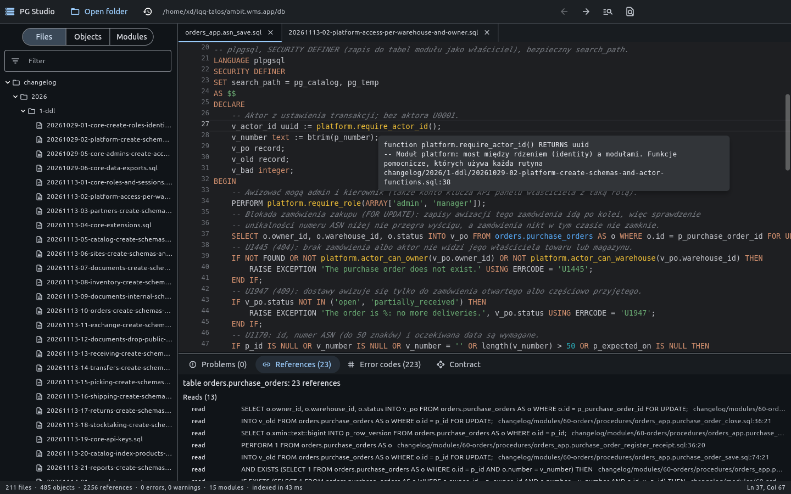

<sub>A procedure of a real warehouse database: hover on a call shows the signature, its comment and where it is
defined; below, every read of <code>orders.purchase_orders</code> - real screens, all of them in
<a href="docs/screens/"><code>docs/screens/</code></a>.</sub>

</div>

---

## Why it is interesting

- **The real PostgreSQL parser, offline.** SQL is parsed by libpg_query 18.1 (the parser of PostgreSQL itself),
  bound through `dart:ffi` and built from a git submodule by a Dart build hook - no server, no `psql`, nothing to
  connect to (ADR 0001).
- **Fast on real projects.** Analysis runs in two phases: every file alone in parallel isolates, then one linking
  pass over the whole project (ADR 0002). A warehouse database of 211 files (485 objects, 2256 references) indexes in
  about 50-170 ms; 902 files of another project in 60 ms, 18 ms when the phase 1 cache in `~/.cache/pg_studio/` is
  warm (compiled CLI, median of 10).
- **It knows what a reference does.** A table use is a read, a write, a foreign key, an index or a trigger; a call
  carries its argument count, so overloads resolve. Column uses are found by alias, so "what breaks if I change
  `orders.purchase_orders.status`" lists the procedures and views directly and through views. Names in the constant
  text of dynamic SQL (`EXECUTE format('... schema.table ...')`) count too.
- **Formatting that cannot break a deployment.** The formatter changes whitespace only and checks that the token
  stream is the same before and after; changesets already deployed (no `runOnChange`, present in `main`) are never
  touched, because Liquibase would reject the new checksum. Tested on three real repositories: same tokens, no lost
  comment, a second run changes nothing (ADR 0004).
- **Refactoring with a preview.** Rename an object or a column: every place in a diff, warnings about API contract
  changes, and a dated `ALTER ... RENAME` changeset plus a `CHANGELOG.md` line - nothing is written until you apply.
- **The conventions of the stack are problems in the editor.** Module boundaries (`changelog/modules/<nn>-<module>/`,
  the `<module>_app` contract), changeset ids, owner roles and `ERRCODE U1xxx` codes are checked by a line-by-line
  port of `check-module-changesets.sh`: a fixture with every rule broken gives the same 41 messages as the script.
- **Safe next to an agent.** The folder is watched: files an agent or `git checkout` writes reload in clean tabs, and
  a tab with unsaved edits asks instead of being overwritten (ADR 0003). The Changes panel shows what the branch
  changed against `main`: objects, new problems, deployed changesets that were edited.
- **Everything is findable without knowing the keys.** One registry of commands feeds the keyboard shortcuts, the
  right-click menus (editor, tabs, trees, panel rows), the help (F1) and the command palette (Ctrl+Shift+P); a test
  checks that every listed shortcut works and every working shortcut is listed.
- **A real terminal next to the code.** Ctrl+` opens your shell in the project folder (xterm.dart on a pty): git,
  liquibase and claude run as usual, files they write are indexed at once, and Ctrl+click on `file.sql:12:5` in the
  output opens the place. Closing a terminal ends everything started in it.
- **The same index for the terminal and Claude Code.** `pg-studio check` gives `file:line:column` problems with an
  exit code for CI; `pg-studio-cli mcp` is an MCP server with definition, references, graph, modules, contract, error
  codes and format check tools.

## Screenshots

All screens come from `integration_test/screens_test.dart`, which drives the real window on the real database folders
of neighbouring repositories; the full set is in [`docs/screens/`](docs/screens/).

| | |
|---|---|
| 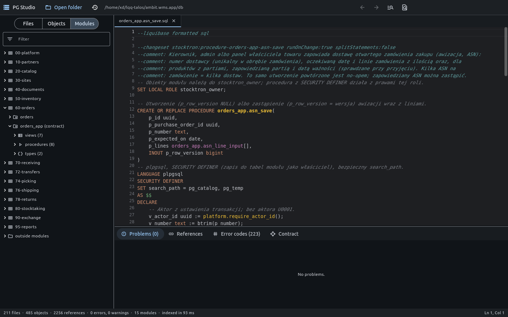 | 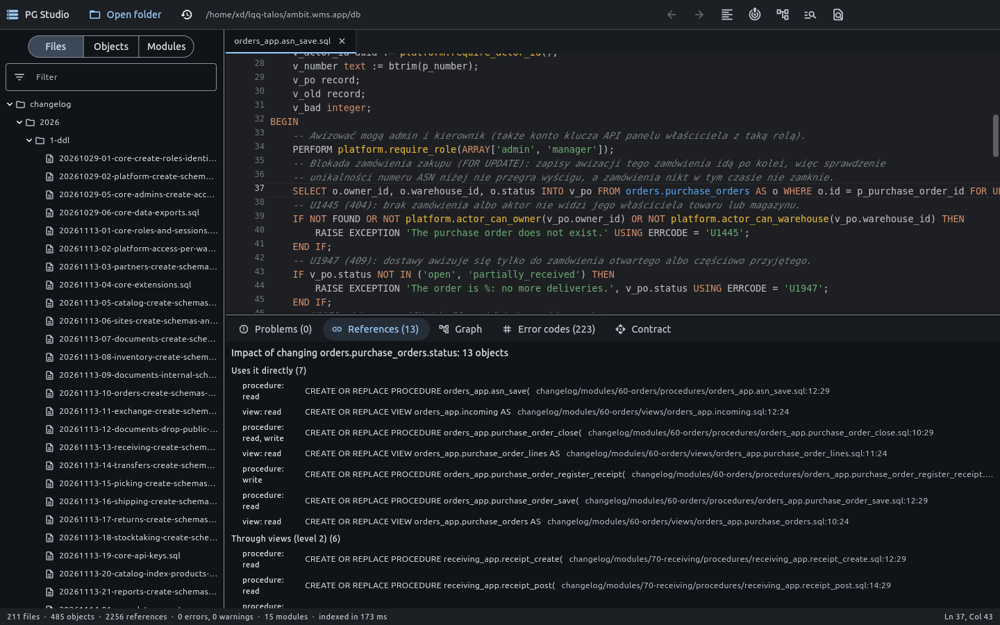 |
| **Modules**: the object tree by module and contract schema, a procedure with Liquibase headers and comments. | **Impact**: what changing `orders.purchase_orders.status` touches - directly and through views. |
| 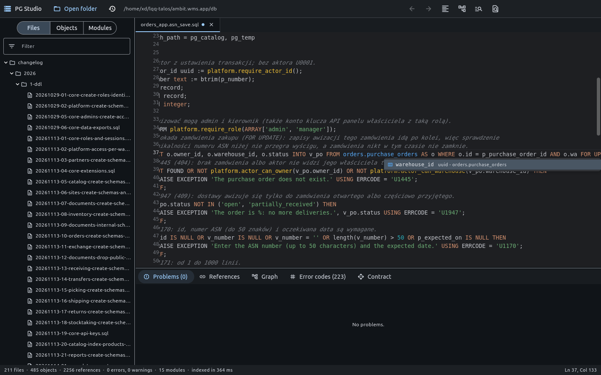 | 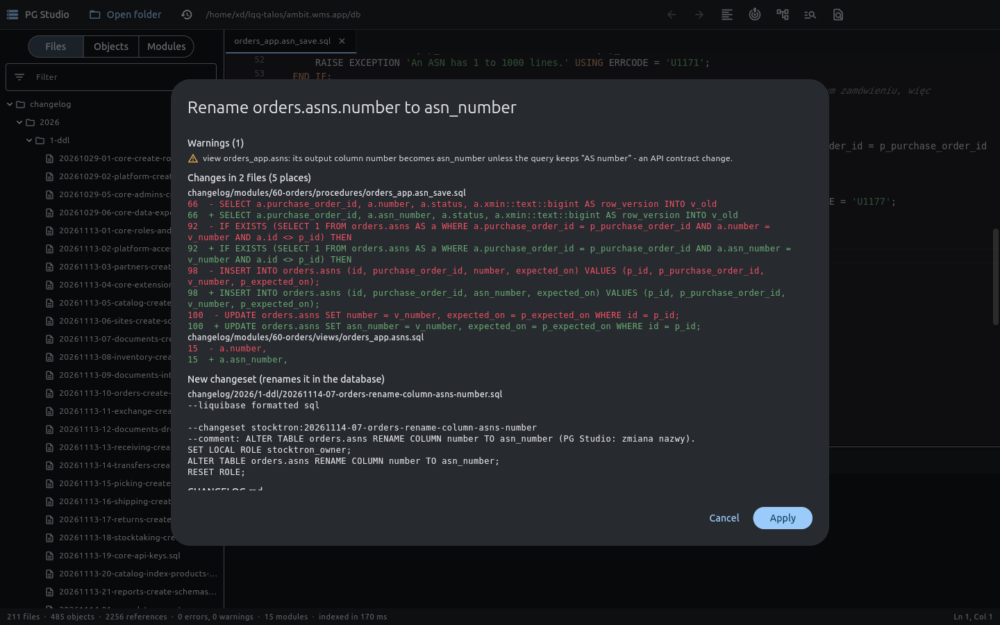 |
| **Completion**: columns by alias with their type and table, objects and parameters while typing. | **Rename**: every change as a diff, a warning about the view's output column, the new changeset. |
| 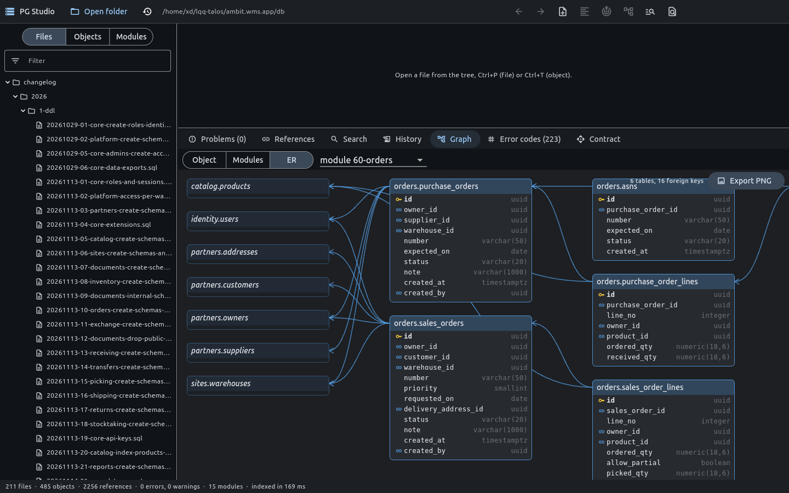 | 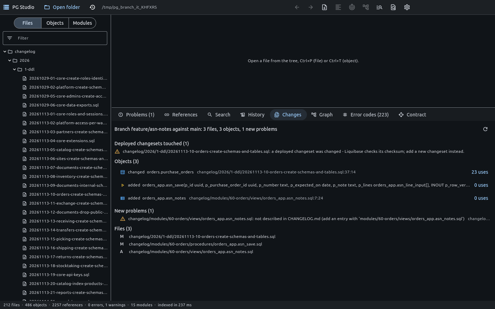 |
| **ER diagram**: tables of a module with keys, foreign keys as arrows, tables of other modules at the side; PNG export, reset of the zoom, its own window (`pg-studio <folder> --er=module:<m>`). | **Changes**: what the current branch changed against `main`, new problems and edited deployed changesets. |
| 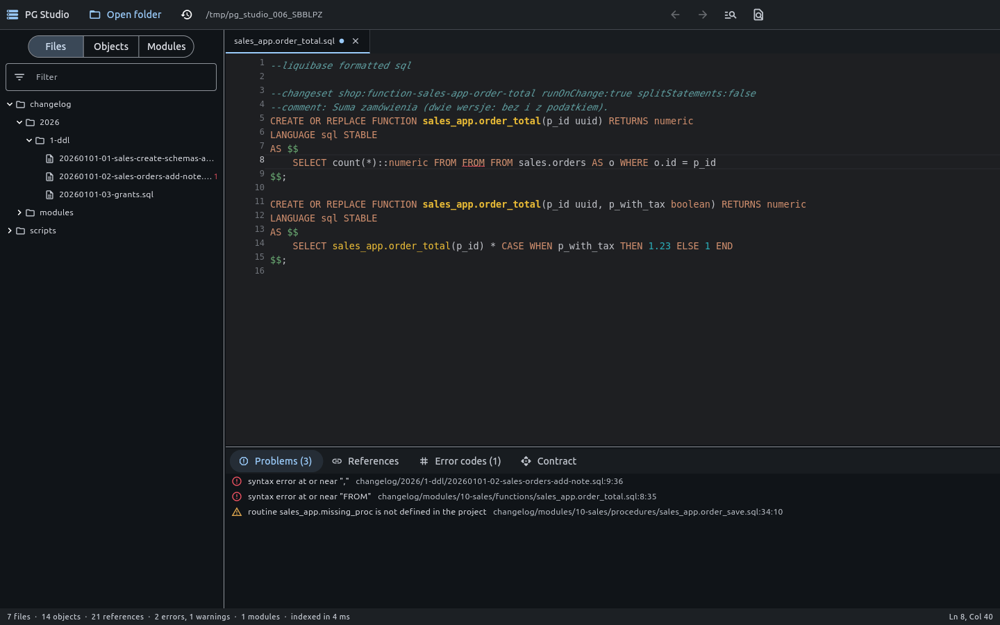 | 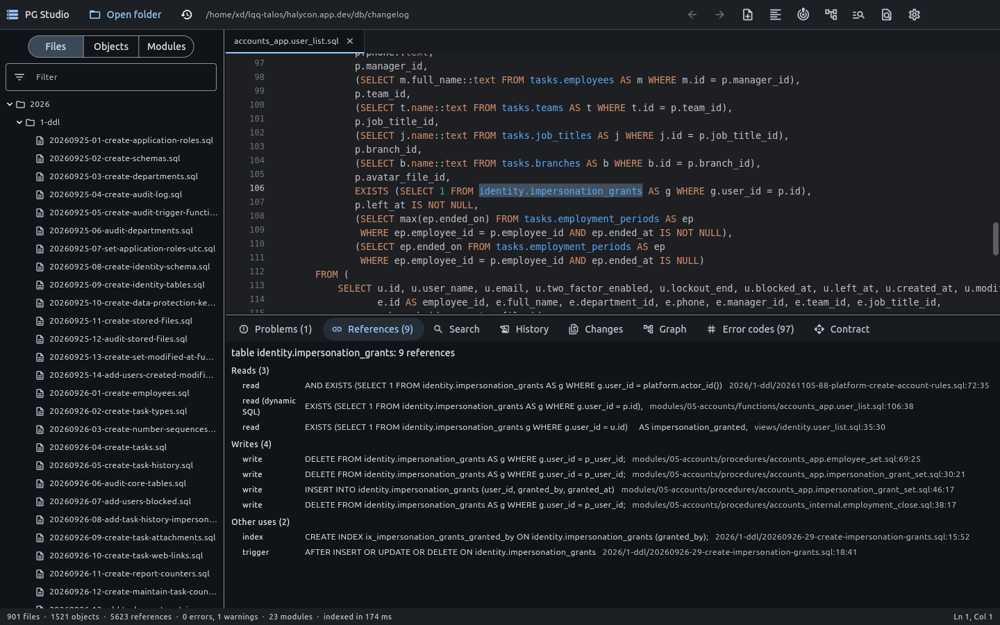 |
| **Live errors**: a syntax error while typing, unresolved names, every problem with `file:line`. | **Dynamic SQL**: a table used inside `EXECUTE format(...)` is a reference too, marked as such. |
| 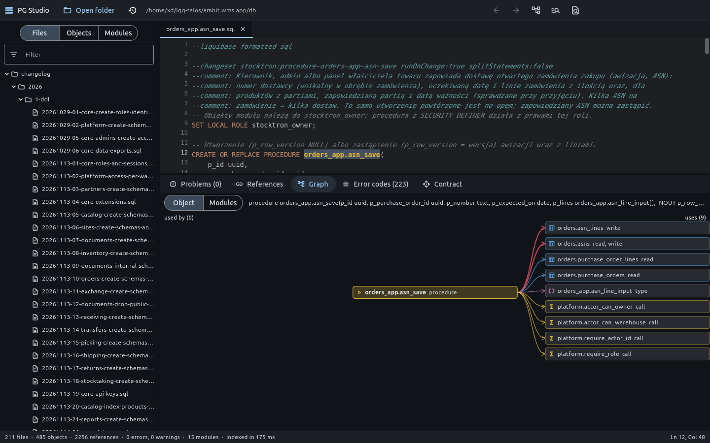 | 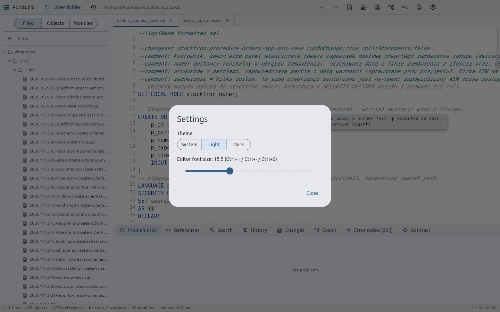 |
| **Graph**: what an object uses and what uses it; the module graph is one click away. | **Settings**: light theme and a larger font; the last folder opens again with its tabs and cursors. |
| 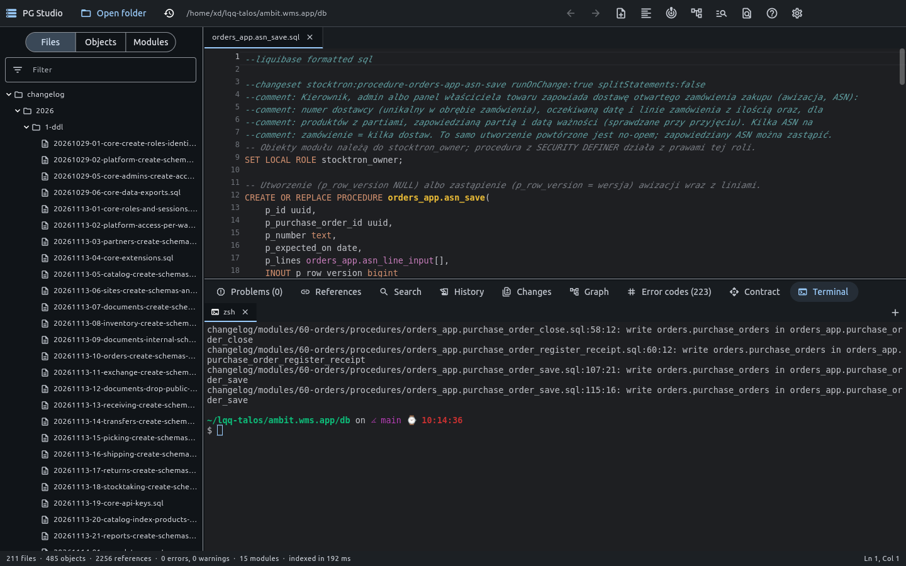 | 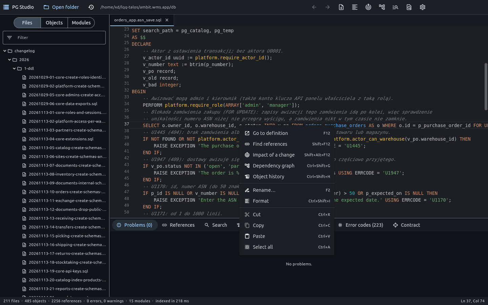 |
| **Terminal**: your shell in the project folder; paths in the output open files. | **Right click**: the commands for the name under the pointer, each with its shortcut. |
| 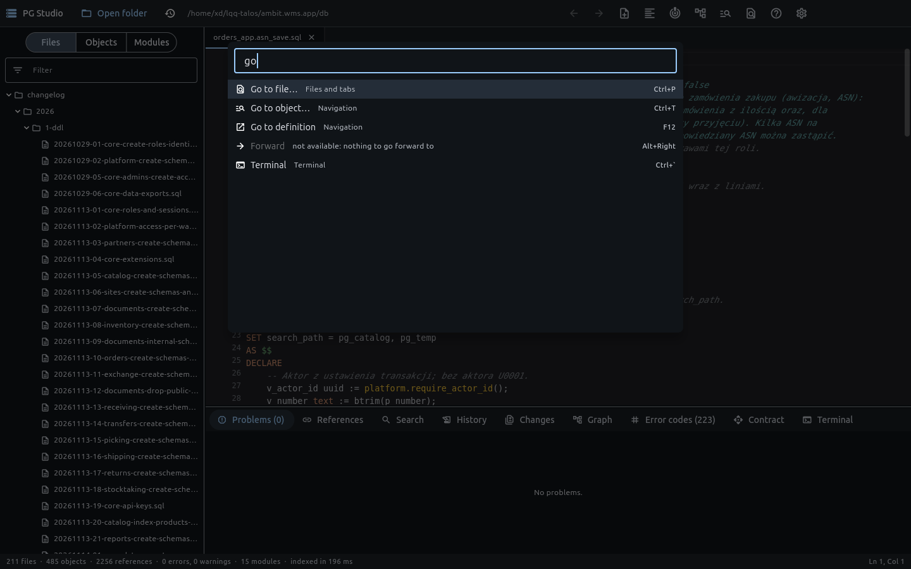 | 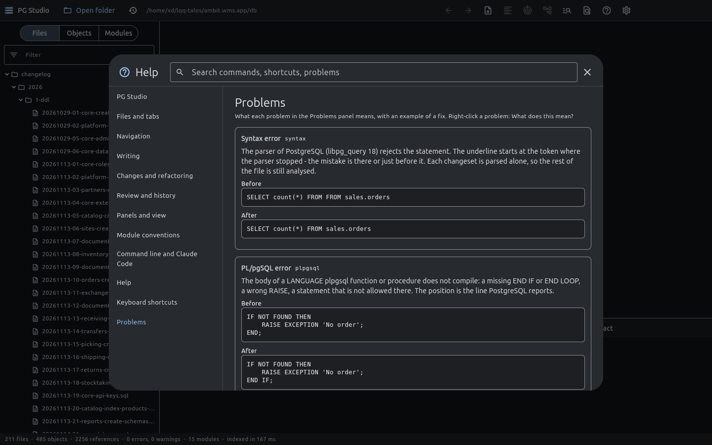 |
| **Command palette**: every command by name, unavailable ones with the reason. | **Help**: what each problem means, with a fix. |

## Architecture

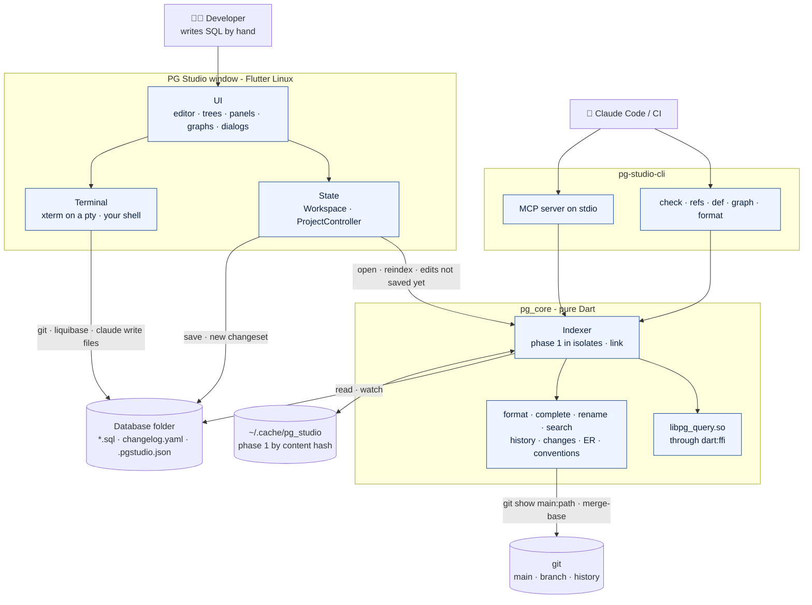
```mermaid
flowchart TB
    dev["🧑‍💻 Developer<br/>writes SQL by hand"]
    agent["🤖 Claude Code / CI"]

    subgraph app["PG Studio window - Flutter Linux"]
        ui["UI<br/>editor · trees · panels · graphs · dialogs"]:::proc
        state["State<br/>Workspace · ProjectController"]:::proc
        term["Terminal<br/>xterm on a pty · your shell"]:::proc
    end

    subgraph cli["pg-studio-cli"]
        cmd["check · refs · def · graph · format"]:::proc
        mcp["MCP server on stdio"]:::proc
    end

    subgraph core["pg_core - pure Dart"]
        indexer["Indexer<br/>phase 1 in isolates · link"]:::proc
        features["format · complete · rename · search<br/>history · changes · ER · conventions"]:::proc
        ffi["libpg_query.so<br/>through dart:ffi"]:::proc
    end

    folder[("Database folder<br/>*.sql · changelog.yaml · .pgstudio.json")]
    cache[("~/.cache/pg_studio<br/>phase 1 by content hash")]
    git[("git<br/>main · branch · history")]

    dev --> ui
    agent --> cmd
    agent --> mcp
    ui --> state
    state -- "open · reindex · edits not saved yet" --> indexer
    cmd --> indexer
    mcp --> indexer
    indexer --> ffi
    indexer --> features
    indexer -- "read · watch" --> folder
    indexer <--> cache
    features -- "git show main:path · merge-base" --> git
    state -- "save · new changeset" --> folder
    ui --> term
    term -- "git · liquibase · claude write files" --> folder

    classDef proc fill:#eef4ff,stroke:#1e4f91,color:#0b1f3a
```

The UI never parses SQL itself: it asks the index of `pg_core`, the same package the CLI and the MCP server use.
Nothing ever connects to a database; git is only read (the deployed state is what is in `main`).

### One edit

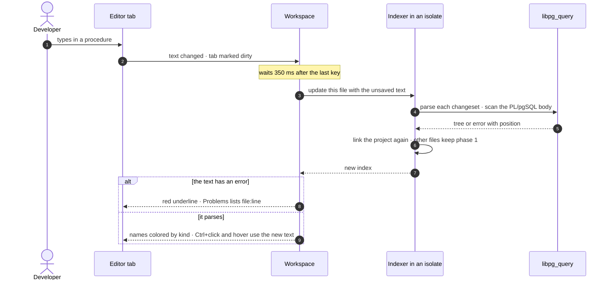
```mermaid
sequenceDiagram
    autonumber
    actor Dev as Developer
    participant Ed as Editor tab
    participant WS as Workspace
    participant IX as Indexer in an isolate
    participant PQ as libpg_query

    Dev->>Ed: types in a procedure
    Ed->>WS: text changed · tab marked dirty
    Note over WS: waits 350 ms after the last key
    WS->>IX: update this file with the unsaved text
    IX->>PQ: parse each changeset · scan the PL/pgSQL body
    PQ-->>IX: tree or error with position
    IX->>IX: link the project again · other files keep phase 1
    IX-->>WS: new index
    alt the text has an error
        WS-->>Ed: red underline · Problems lists file:line
    else it parses
        WS-->>Ed: names colored by kind · Ctrl+click and hover use the new text
    end
```

### Packages and who uses whom

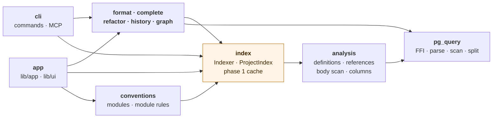
```mermaid
flowchart LR
    pq["<b>pg_query</b><br/>FFI · parse · scan · split"]
    an["<b>analysis</b><br/>definitions · references<br/>body scan · columns"]
    ix["<b>index</b><br/>Indexer · ProjectIndex<br/>phase 1 cache"]:::heart
    fe["<b>format · complete<br/>refactor · history · graph</b>"]
    cv["<b>conventions</b><br/>modules · module rules"]
    cl["<b>cli</b><br/>commands · MCP"]
    ap["<b>app</b><br/>lib/app · lib/ui"]

    an --> pq
    ix --> an
    cv --> ix
    fe --> ix
    fe --> pq
    cl --> fe
    cl --> ix
    ap --> fe
    ap --> ix
    ap --> cv

    classDef heart fill:#fff4e5,stroke:#b26a00,color:#3d2600
```

An arrow means "uses". Everything left of `app` is pure Dart without Flutter (`packages/pg_core/lib/src/`), so the
CLI and the tests run with `dart` alone.

## Flows

### From files to an index

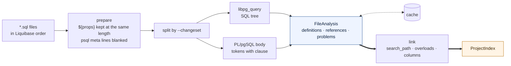
```mermaid
flowchart LR
    files["*.sql files<br/>in Liquibase order"] --> prep["prepare<br/>${props} kept at the same length<br/>psql meta lines blanked"]
    prep --> split["split by --changeset"]
    split --> parse["libpg_query<br/>SQL tree"]
    split --> body["PL/pgSQL body<br/>tokens with clause"]
    parse --> fa["FileAnalysis<br/>definitions · references · problems"]:::doc
    body --> fa
    fa <-.-> cache[("cache")]
    fa ==> link["link<br/>search_path · overloads · columns"]
    link ==> index["ProjectIndex"]:::heart

    classDef doc fill:#eef4ff,stroke:#1e4f91,color:#0b1f3a
    classDef heart fill:#fff4e5,stroke:#b26a00,color:#3d2600
```

Offsets from the parser (UTF-8 bytes) are mapped to UTF-16 by `SourceText`, so a click lands on the right character
in Polish comments too. A syntax error stays inside its changeset; the rest of the file is still analysed.

### An editor tab

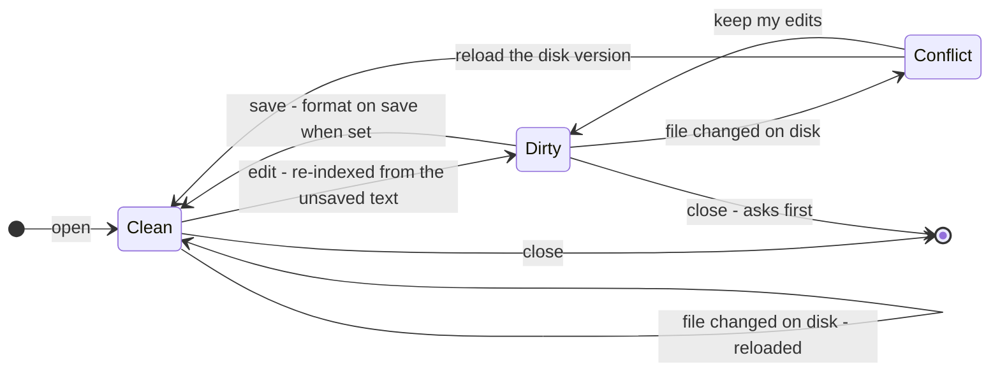
```mermaid
stateDiagram-v2
    direction LR
    [*] --> Clean: open
    Clean --> Dirty: edit - re-indexed from the unsaved text
    Dirty --> Clean: save - format on save when set
    Clean --> Clean: file changed on disk - reloaded
    Dirty --> Conflict: file changed on disk
    Conflict --> Clean: reload the disk version
    Conflict --> Dirty: keep my edits
    Clean --> [*]: close
    Dirty --> [*]: close - asks first
```

## Stack

| Area | Choice |
|---|---|
| App | Flutter 3.47 / Dart 3.13, Linux desktop only, Material 3 |
| Editor | `re_editor` 0.10 with our own spans, pointer mapping and completion |
| Parser | libpg_query 18.1.0 (git submodule) through `dart:ffi`, built by a Dart build hook |
| Analysis | `packages/pg_core`: pure Dart, isolates, phase 1 cache in JSON |
| Disk and git | `watcher` for the folder, `git` processes for `main`, branches and history |
| Terminal | `xterm` 4.0 (TerminalView) on `flutter_pty` 0.4 |
| Package | `.deb` for Debian 13 / Ubuntu 26.04, checked by lintian and in clean containers |
| Tests | `dart test` (unit and real folders), widget tests, `integration_test` on the real window |

## Documentation

| Document | What is in it |
|---|---|
| [`PRODUCT.md`](PRODUCT.md), [`PRODUCT-2.0.md`](PRODUCT-2.0.md), [`PRODUCT-3.0.md`](PRODUCT-3.0.md) | goals, never / not yet, decisions and specs with criteria (mirror of the SDD project, in Polish) |
| [`docs/adr/`](docs/adr/) | 0001 libpg_query through FFI · 0002 two-phase analysis · 0003 UI state, editor and disk · 0004 whitespace-only formatting · 0005 the .deb package |
| [`docs/screens/`](docs/screens/) | screenshots of every feature, written by the integration test |
| [`CLAUDE.md`](CLAUDE.md) | commands, architecture and rules for an agent working in this repository |

## Install (Debian 13, Ubuntu 26.04)

Download the `.deb` from the [latest release](https://github.com/ambit-project/ambit-pg-studio/releases/latest):

```bash
curl -LO https://github.com/ambit-project/ambit-pg-studio/releases/download/v3.1.0/pg-studio_3.1.0_amd64.deb
sudo apt install ./pg-studio_3.1.0_amd64.deb
```

Or build it from the source:

```bash
scripts/package-deb.sh                                  # build/deb/pg-studio_<version>_amd64.deb
sudo apt install ./build/deb/pg-studio_*_amd64.deb      # dependencies come from the archive
pg-studio ~/projects/my-app/db                          # or PG Studio in the applications menu
sudo apt remove pg-studio
```

`./verify package` builds it, runs lintian and installs, starts (with a terminal) and removes it in clean `ubuntu:26.04` and
`debian:13` containers (docker). Settings and sessions: `~/.config/pg-studio/settings.json`; formatting and convention
options: `.pgstudio.json` in the project.

## Use

**F1** (or the **?** button) opens the help: what every command does, every keyboard shortcut and what each problem
means, with search. **Right-click** anything - a name in the editor, a tab, a file or object in the tree, a row of a
panel - to see what can be done with it, each command with its shortcut. The ones to remember:

| Key | What |
|---|---|
| Ctrl+click, F12 / Shift+F12 | go to the definition / find references |
| Ctrl+T / Ctrl+P | go to an object / a file |
| Alt+Left / Alt+Right | back / forward |
| Shift+Alt+F12 | impact of changing the object or column at the cursor |
| F2 | rename in the whole project, with a preview |
| F1 | help (on a line with a problem: what it means) |
| Ctrl+Shift+P | command palette |
| Ctrl+` | terminal in the project folder |

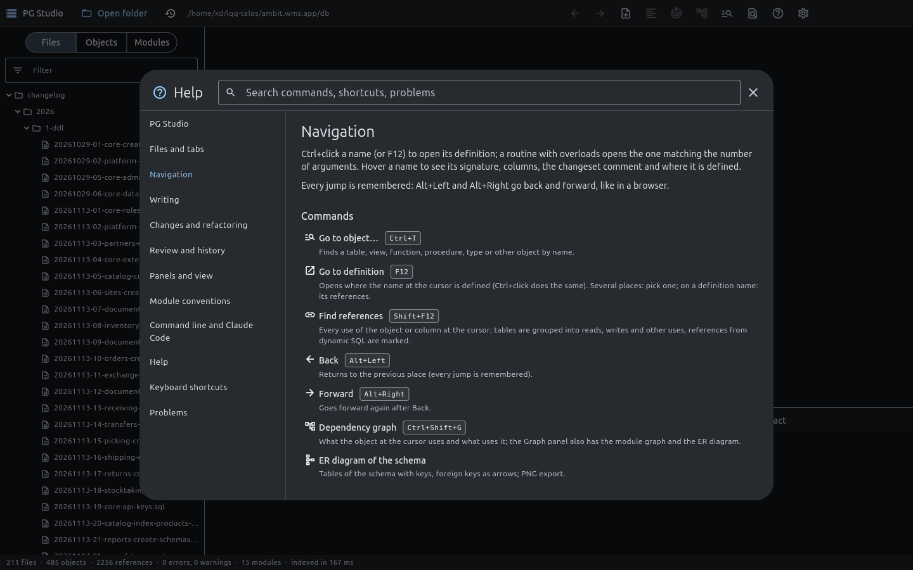

## Command line and Claude Code (MCP)

```bash
pg-studio check db/                      # problems as file:line:column; exit 1 on errors (--strict: warnings too)
pg-studio refs db/ orders.purchase_orders --kind write
pg-studio def db/ asn_save               # also: graph, modules, contract [module], codes [U1445]; --json
pg-studio format db/ --check             # files the formatter would change; exit 1 if any (pre-commit / CI)
claude mcp add pg-studio -- pg-studio-cli mcp /path/to/app/db
```

`pg-studio-cli` (and `pg-studio <command>`) uses the same index as the window and the same cache (`--no-cache` to
skip it, `--timing` for the index time). The MCP server notices files the agent writes before each answer. Without
the package: `cd packages/pg_core && dart run bin/pg_studio_cli.dart <command> <folder>`.

## Run and build

```bash
git submodule update --init       # libpg_query 18.1.0 in third_party/
flutter run -d linux
flutter build linux --release     # build/linux/x64/release/bundle/pg_studio
```

Requirements: Flutter 3.47 with Linux desktop enabled (`flutter config --enable-linux-desktop`),
`sudo apt install clang cmake ninja-build libgtk-3-dev make gcc`. The first build compiles libpg_query (about 10 s)
through the build hook of `packages/pg_core`; later builds reuse it.

## Tests

```bash
./verify core          # pg_core unit tests (86)
./verify corpus        # the real database folders of ../ambit.wms.app, ../halycon.app.dev, ../ambit.jobtron.app (15)
./verify conventions   # module rules against the original script
./verify lint          # dart format (page width 120) and analyzers
flutter test           # widget tests (49)
./verify terminal      # the terminal with a real shell on the real window
flutter test integration_test/screens_test.dart -d linux   # the real window, writes docs/screens/ (16)
./verify all           # before a pull request
```

The corpus tests read the neighbouring repositories only (no files, caches or branches there) and are skipped when
a folder is missing.

## License

[MIT](LICENSE). The bundled libpg_query (BSD-3-Clause, PostgreSQL License) and Flutter engine (BSD-3-Clause)
keep their own licenses, listed in `/usr/share/doc/pg-studio/copyright` of the package.
